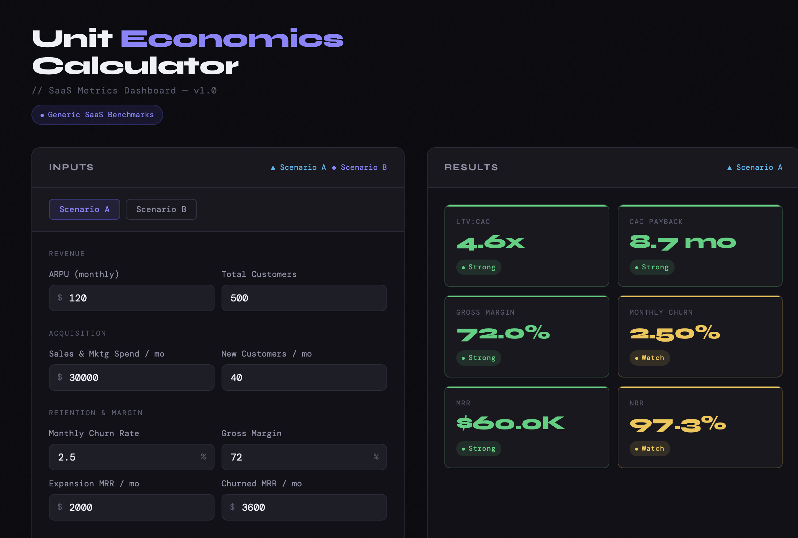

# 📊 Unit Economics Calculator

**[→ Live Demo](https://deckelsf.github.io/unit-economics-calculator)**

An interactive SaaS unit economics calculator with side-by-side scenario comparison, health score benchmarks, and metric explainers. Built as a single-file vanilla JS app — no build tools, no dependencies beyond Chart.js.

---

## Features

- **6 core SaaS metrics** — LTV:CAC ratio, CAC payback period, gross margin, monthly churn, MRR, and NRR, all calculated in real time from your inputs
- **Side-by-side scenario comparison** — model two sets of assumptions simultaneously and compare outputs across every metric
- **Health score badges** — green / yellow / red indicators on each metric benchmarked against generic SaaS thresholds
- **Radar chart** — both scenarios overlaid so you can instantly spot where one underperforms the other
- **Metric explainers + recommendations** — expandable panels for each metric with a plain-English definition and a dynamic recommendation based on your actual values
- **Pre-loaded defaults** — sensible example values so the app is useful immediately without any setup

---

## Metrics Covered

| Metric | What it measures |
|---|---|
| **LTV:CAC Ratio** | Lifetime value vs. cost to acquire — efficiency of your growth engine |
| **CAC Payback Period** | Months to recover acquisition cost through gross-margin-adjusted revenue |
| **Gross Margin %** | Revenue minus COGS — the foundation of SaaS unit economics |
| **Monthly Churn Rate** | Percentage of customers lost per month |
| **MRR** | Monthly recurring revenue from your current customer base |
| **NRR** | Net revenue retention — whether existing customers are growing or shrinking your revenue |

---

## Benchmarks

Health scores are benchmarked against generic SaaS thresholds:

| Metric | 🟢 Strong | 🟡 Watch | 🔴 At Risk |
|---|---|---|---|
| LTV:CAC | ≥ 3x | 1–3x | < 1x |
| CAC Payback | ≤ 12 mo | 12–24 mo | > 24 mo |
| Gross Margin | ≥ 70% | 50–70% | < 50% |
| Monthly Churn | ≤ 2% | 2–5% | > 5% |
| MRR | ≥ $50K | $10K–$50K | < $10K |
| NRR | ≥ 100% | 90–100% | < 90% |

---

## How to Use

1. Open the [live app](https://deckelsf.github.io/unit-economics-calculator)
2. Edit inputs under **Scenario A** — revenue, acquisition spend, churn, and margin figures
3. Switch to **Scenario B** to model an alternative set of assumptions
4. View results, radar chart, and comparison table updating in real time
5. Expand any metric card to read the explainer and see a recommendation based on your numbers

---

## Built With

- Vanilla JavaScript (no framework)
- [Chart.js](https://www.chartjs.org/) — radar chart
- [Google Fonts](https://fonts.google.com/) — Syne + DM Sans + DM Mono
- Deployable as a single `index.html` file via GitHub Pages

---

## About

Built by a PM at [Workstream](https://www.workstream.us) (SMB SaaS — hiring, HR, and payroll) as a portfolio project demonstrating applied product thinking around SaaS metrics and unit economics.
